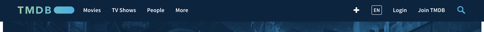
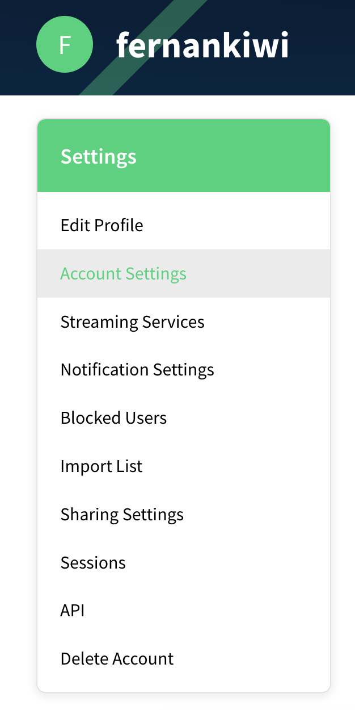

# FlickPicks + React + themoviedb
Just a simple website that connects to Themoviedb API

#### For it to work, you must extract an API from https://www.themoviedb.org/

1. Click on Login

2. Go to your user settings & Click on API

3. Fill in with mock data & Retrieve an API Key

#### In the project directory, you can run:

### `touch .env`

Inside .env paste : `REACT_APP_MDB_API_KEY=<YOUR_API_KEY>`

### `yarn install`

### `yarn start`

Runs the app in the development mode.\
Open [http://localhost:3000](http://localhost:3000) to view it in the browser.
